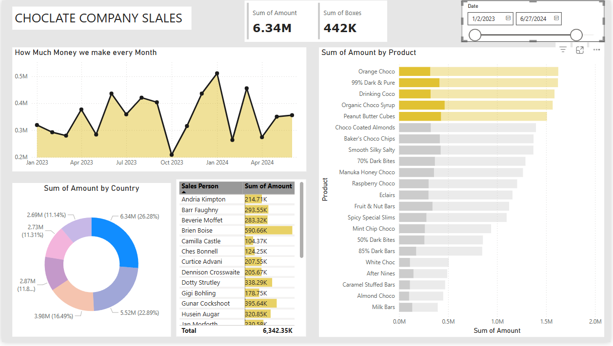

# Chocolate Company Sales Dashboard

This Power BI dashboard provides an overview of sales performance for a fictional chocolate company.

## Insights Provided:
- Monthly revenue trends
- Product-wise sales comparison
- Country-wise sales distribution
- Sales preformance by salesperson 

## Tools Used:
- Power BI Desktop
- Data Modeling
- Visual Analytics

## How It Was Built:
This dashboard was created by following a YouTube tutorial and customizing the visuals to explore different features of Power BI.

## Preview:

